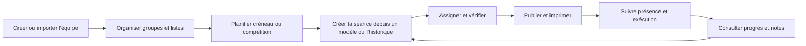

# Audit du parcours coach — DivePlan

## Objet et portée

Cet audit couvre les routes coach, leurs composants d’interface et leurs actions serveur : accueil, planning, séances, athlètes, groupes, listes de compétition, progression, bibliothèque, modèles, milestones, monitoring et réglages. Il décrit l’expérience construite dans le code du projet, pas une validation avec des coachs de clubs. Les constats marqués **bloquant** découlent de contrôles visibles sans action reliée ou d’actions présentes dans le code mais absentes des écrans.

## Résumé produit

DivePlan possède déjà une base métier substantielle : planification, construction de séances, blocs dryland et piscine, assignations, modèles, impression, progression et suivi. Le problème principal est que ces capacités fonctionnent comme une collection de modules plutôt que comme un flux continu de travail. Le coach doit souvent comprendre la structure du logiciel, refaire des opérations par personne ou deviner si une action a réussi.

La promesse à rendre évidente est : **préparer un entraînement à partir du planning et de l’historique, le partager aux bons athlètes, l’utiliser au bord du bassin, puis voir ce qui s’est passé et quoi ajuster.** La gestion des athlètes, groupes et listes doit soutenir ce cycle sans devenir une série de formulaires isolés.

## Constats détaillés par domaine

### 1. Navigation et repérage

- La navigation principale expose huit destinations au même niveau. Réglages et monitoring sont relégués dans une rangée d’icônes, tandis que « Bibliothèque » et « Template » sont séparés même si l’écran bibliothèque présente aussi les modèles.
- Plusieurs libellés sont en anglais ou varient selon l’écran : « Template(s) », « Milestones », « Monitoring », « Athletes », « Nouvelle séance » et « Nouvelle seance ».
- Sur mobile, la navigation principale devient une bande horizontale défilante. Les destinations ne sont donc pas toutes visibles et les outils du bas occupent une seconde rangée.
- Les actions de création sont spécifiques à chaque page; il n’existe pas de point d’entrée universel pour les tâches courantes.

**Proposition :** ramener la navigation à cinq espaces : **Aujourd’hui**, **Planning**, **Entraînement**, **Équipe**, **Progression**. Mettre modèles et bibliothèque dans Entraînement; athlètes et groupes dans Équipe; listes de compétition, évaluations et milestones dans Progression. Déplacer monitoring et réglages sous **Administration**. Garder une action **Créer** avec des choix contextuels, et une navigation mobile compacte avec accès direct aux cinq espaces.

### 2. Accueil coach

- Le tableau de bord juxtapose séance principale, semaine, groupes et activité récente. Il ne constitue pas encore une file de travail ordonnée qui distingue ce qui doit être préparé, exécuté ou révisé.
- Les entrées de semaine et les statuts n’indiquent pas toujours le prochain geste attendu; les séances et les horaires sans séance sont deux objets différents.
- Le panneau de lecture rapide contenait des valeurs de démonstration en dur; le correctif apporté dans la session le rend calculé depuis les données réelles, mais ne remplace pas une vraie vue des tâches.

**Proposition :** faire de l’accueil une file d’actions groupée par **À préparer**, **Aujourd’hui**, **À suivre** et **À revoir**. Chaque ligne affiche groupe, heure, état, personnes concernées, action primaire et lien secondaire vers le détail. Inclure les créneaux récurrents sans séance liée, les brouillons incomplets, les présences à vérifier et les retours athlètes récents. Chaque carte doit disparaître de la file quand l’action correspondante est terminée.

### 3. Athlètes et comptes

- La liste d’athlètes n’a ni recherche ni filtres malgré ses colonnes de groupe, niveau, état et activité. Le seul bouton d’action par ligne est la suppression; ouvrir le nom est le chemin implicite vers les autres informations.
- Le formulaire de création de compte est placé avant la liste et demande plusieurs données d’un seul coup. Les champs s’appuient surtout sur des placeholders plutôt que des libellés visibles.
- L’import CSV a un composant et une action serveur, mais le composant n’est pas utilisé par la page des athlètes. L’import documenté est donc introuvable dans l’interface actuelle.
- Le code contient aussi une action pour créer un athlète sans compte de connexion, mais aucun point d’entrée visible ne l’expose.
- Je n’ai pas trouvé de parcours coach pour modifier les informations de base après création : nom, niveau, naissance, groupe ou état actif.
- La création affiche un identifiant et un mot de passe temporaire à remettre manuellement. La page précise que le mot de passe ne sera plus visible après avoir quitté la page; aucune invitation par courriel ni réinitialisation n’est configurée.

**Proposition :** transformer la liste en répertoire d’équipe avec recherche instantanée, filtres groupe/niveau/actif/à surveiller, tri, sélection multiple et actions en lot. Mettre **Ajouter un athlète** en action principale, puis proposer deux chemins explicites : créer une fiche (sans accès athlète) ou créer un compte, avec import CSV comme troisième option. Pour l’import, ajouter téléchargement d’un gabarit, prévisualisation, validation de chaque ligne, détection des doublons, choix entre ignorer/mettre à jour, résumé avant confirmation et rapport téléchargeable après import. Ajouter une édition de fiche, activation/désactivation, déplacement de groupe, historique des changements et suppression exceptionnelle avec aperçu des impacts.

### 4. Fiche athlète et liste de compétition

- La fiche rassemble profil, prochaine compétition, événements, séances récentes, présence, progrès, compétences, notes techniques, évaluation de confiance et liste de plongeons dans une page longue. Les vues d’ensemble et les actions se concurrencent.
- L’édition de la liste se fait plongeon par plongeon : ajout, DD, retrait, réordonnancement par glisser-déposer ou flèches. Les changements d’ordre sont enregistrés séparément; la confirmation est surtout un état temporaire « Enregistrement de l’ordre… ».
- Le retrait d’un plongeon n’a pas de confirmation visible. Il n’existe pas de flux de copie d’une liste ou d’un ensemble de plongeons vers un autre athlète.
- La logique de difficulté suggérée à la saisie est utile, mais le coach doit vérifier la valeur et comprendre la différence entre une valeur calculée et une valeur personnalisée.

**Proposition :** découper la fiche en onglets persistants **Résumé**, **Entraînement**, **Compétition**, **Progression**, **Profil et accès**. Dans Compétition, choisir la compétition puis la hauteur; éditer la liste dans un panneau dédié avec code, nom si disponible, DD, ordre, validation et notes. Ajouter ajout rapide de plusieurs lignes, copier depuis une compétition précédente, appliquer à des athlètes sélectionnés, historique/annulation et avertissement des changements non enregistrés. Les règles de validation de la liste doivent être configurées selon la catégorie/compétition, pas codées comme une règle universelle.

### 5. Groupes et assignations

- La page d’organisation permet création, lecture et suppression, mais pas renommage ni archivage.
- La grille d’affectation répète la liste complète des athlètes dans chaque groupe. Cocher un athlète dans un groupe peut le déplacer d’un autre groupe; le comportement n’est pas expliqué comme un transfert et le formulaire ne rend pas clairement visible le résultat global avant sauvegarde.
- Enregistrer une affectation vide retire tous les athlètes du groupe. Le coach ne reçoit pas d’aperçu explicite de ces retraits.
- Le détail de groupe et la vue « Provincial » affichent des cases de sélection, sans `form`, sans nom de champ et sans action associée. **Ces contrôles sont actuellement inertes.**
- La suppression est désactivée si le groupe possède des semaines d’entraînement; l’interface ne mène pas vers la résolution de cette dépendance.

**Proposition :** faire de la page Groupe un effectif avec recherche, membres, niveau, prochaine séance et actions **Modifier le groupe**, **Préparer une séance**, **Gérer les membres**. La gestion des membres se fait dans un seul écran avec colonnes **Dans le groupe**, **Autres groupes**, **Sans groupe**; chaque transfert affiche son impact et s’enregistre une fois. Les cases du détail deviennent une vraie sélection multiple avec actions contextualisées (ajouter à une séance, changer de groupe, exporter), sinon elles sont retirées. Pour supprimer/archiver, présenter les séances et horaires affectés, puis proposer transfert, archivage ou annulation.

### 6. Planning et événements

- Le planning propose semaine/mois, navigation temporelle, ajout d’horaire, camp ou compétition, récurrence hebdomadaire, cible club/groupe/athlète, édition dans une fenêtre et suppression confirmée.
- Un **horaire d’entraînement** et une **séance** sont deux enregistrements distincts. Le coach doit comprendre qu’il faut ensuite lier/créer le contenu de séance; les créneaux sans séance affichent un lien vers le builder, mais ne préremplissent pas nécessairement le contexte de façon évidente.
- Le formulaire d’événement est visible en haut du planning quel que soit le type de tâche; l’édition ferme sa fenêtre sur soumission sans attendre le résultat de l’action.
- Les séances et les événements occupent le même calendrier mais n’offrent pas exactement les mêmes actions, statuts ou interactions.

**Proposition :** faire du créneau le point de départ unique. À partir d’un horaire, **Créer la séance** préremplit date, heure, groupe et lieu et lie automatiquement les deux objets. À la création d’un horaire récurrent, proposer une action distincte **Générer les séances de la série** ou **Créer les horaires seulement**. Ajouter une vue agenda mobile, filtres groupe/coach/type, conflits de temps et confirmations de résultat dans les fenêtres. À l’édition d’une occurrence récurrente, demander si le changement vise cette occurrence ou la série.

### 7. Séances : création, modification, publication, suivi et impression

- Le builder de création est un assistant en cinq étapes : détails, dryland, piscine, assignations, publication; il utilise aussi une sauvegarde locale automatique.
- L’édition d’une séance publiée est un autre formulaire, plus dense, distinct du builder. La modification est bloquée après le démarrage, avec l’option de dupliquer pour modifier; ce comportement mérite une explication et un chemin clair pour corriger une erreur.
- L’étape Publication présente aperçu/impression désactivés avant création, alors que la valeur attendue d’un aperçu est précisément de réduire les erreurs avant publication.
- Les assignations par bloc offrent modes groupe/sous-groupe/individuel. « Sous-groupe » choisit automatiquement les trois premiers athlètes; cette règle arbitraire peut produire une assignation incorrecte. La sélection se fait bloc par bloc.
- Les séances sont listées sous un en-tête « Cette semaine », alors que la requête récupère toutes les séances. Les actions supprimer/non faite sont condensées en icônes dans la liste; ailleurs, certaines actions sensibles sont des boutons directs.
- Le détail propose publier, dupliquer, modifier, imprimer, marquer non faite, supprimer, sauver comme modèle, noter les absences, corriger les données réelles et marquer une completion manuellement. Ces opérations n’ont pas encore une hiérarchie commune selon l’état de la séance.

**Proposition :** unifier création et édition dans le même éditeur à sections repliables, avec indicateur d’avancement et résumé fixe. Le démarrage propose **Modèle**, **Séance précédente**, **Séance vierge**; puis le coach choisit groupe et créneau. Ajouter un aperçu imprimable avant publication, une vérification finale des blocs sans athlètes, durée, volume et groupe, et des actions **Enregistrer le brouillon** / **Publier pour le groupe** explicites. Remplacer « sous-groupe = trois premiers » par une sélection mémorisée ou un sous-groupe nommé. Définir un cycle lisible : Brouillon → Prête → En cours → Terminée / Non tenue; une séance commencée devient verrouillée, mais le coach peut corriger les données réalisées sans modifier le plan initial. Regrouper les actions secondaires dans un menu et confirmer les suppressions avec impact sur le suivi athlète.

### 8. Bibliothèque et modèles

- Les exercices peuvent être créés, édités, favoris, filtrés, prévisualisés, archivés et ajoutés à une séance; les modèles ont favoris, chargement et suppression.
- Les modèles sont visibles à la fois dans la bibliothèque et dans la page séparée « Template ». Il y a donc deux points d’entrée pour la même ressource et deux conventions de présentation.
- Le chargement d’un modèle est un lien vers le builder; la différence entre modèle complet, bloc dryland et exercice individuel pourrait être plus explicite.

**Proposition :** une bibliothèque unique avec onglets **Exercices**, **Modèles de séance**, **Blocs enregistrés**. Chaque fiche indique type, groupe/niveau recommandé, dernière utilisation, contenu et bouton **Utiliser**. La sélection ouvre le builder avec l’élément injecté et un bandeau de contexte; préserver le favori et le filtre au retour. Prévoir archivage plutôt que suppression pour les exercices utilisés dans l’historique.

### 9. Progression, milestones, monitoring et administration

- Milestones éditables et progression athlète existent, mais la configuration des milestones est une destination de premier niveau, sans relation évidente avec une tâche quotidienne.
- Monitoring est accessible comme outil isolé; les événements récents existent aussi sur l’accueil et dans les fiches. On ne sait pas toujours quelle vue est destinée au coach et laquelle est un outil d’administration.
- Les réglages combinent identité du club, compte coach et préférences d’affichage. La gestion des autres coachs est absente, tout comme les rôles partagés, pourtant nécessaires à plusieurs clubs.

**Proposition :** distinguer **Suivi sportif** (présence, progrès, évaluations, milestones et alertes coach) de **Journal système** (audit et diagnostic). Réunir les réglages du club, préférences, gestion des coachs et accès dans Administration. Ajouter des rôles simples (propriétaire/admin, coach) et des invitations avec expiration/révocation avant de vendre à une équipe. Maintenir le suivi d’audit pour les modifications de listes, membres, comptes et séances.

### 10. Mode démo et vente

- Le mode demo rend certains exemples visibles, mais des actions sont désactivées ou mènent à des pages qui nécessitent la base de données. Cela ne permet pas toujours de démontrer un parcours de bout en bout.
- Les accès athlètes reposent sur la remise manuelle de mots de passe temporaires; les invitations par courriel et la facturation autonome sont identifiées comme non disponibles dans le projet.

**Proposition :** livrer un espace de démonstration isolé et cohérent avec des données synthétiques, où chaque action de la visite guidée se termine correctement sans affecter un vrai club. Pour l’offre pilote, prévoir un onboarding accompagné, import vérifié, création des coachs et athlètes, assistance à la connexion, export des données et règles de support. La facturation automatique peut attendre la validation du modèle de prix; les accès d’équipe et le transfert sécurisé des comptes doivent être définis avant la commercialisation multi-club.

## Parcours cible de bout en bout

Chaque étape doit garder le contexte utile : depuis un groupe, la séance connaît le groupe; depuis un créneau, elle connaît date et heure; depuis une liste de compétition, l’athlète et l’épreuve restent sélectionnés; après sauvegarde, le coach revient à l’objet qu’il modifiait avec un message de réussite.

## Plan de livraison recommandé

### Phase 0 — Réparer la confiance (avant refonte visuelle)

1. Brancher le formulaire d’import CSV et exposer la création d’une fiche coach seulement.
2. Supprimer ou rendre fonctionnelles les cases inertes du détail et de la vue provinciale.
3. Ajouter l’édition des informations de base de l’athlète et le renommage du groupe.
4. Mettre confirmation et feedback cohérents sur suppression, retrait de plongeon, changement de groupe, import et sauvegarde.
5. Corriger le titre/périmètre de la liste de séances; ne jamais annoncer une semaine si toute l’historique est affiché.

### Phase 1 — Effectif et listes (valeur quotidienne élevée)

Créer le répertoire Équipe, édition de profil, filtres, actions multiples, flux de membres de groupes, fiche athlète à onglets et éditeur de listes avec copie/historique/validation. Tester avec des cohortes représentatives de petits et grands clubs.

### Phase 2 — Cycle de séance

Unifier le builder et l’édition; intégrer modèle, historique, créneau, publication, impression et suivi. Traiter le mobile/tablette au bassin comme un cas principal. Ajouter autosauvegarde visible, reprise de brouillon, aperçu final, statut explicite et duplication contrôlée.

### Phase 3 — Planning et ressources

Lier horaire et séance, améliorer la récurrence et les changements de série, regrouper modèles/exercices/blocs, et conserver les contextes de filtre/retour.

### Phase 4 — Multi-coach et préparation pilote payant

Invitations/permissions, audit compréhensible, export, onboarding club, démo complète, documentation courte et procédures de support. Confirmer sauvegardes, confidentialité et accès aux données avant les premiers clubs payants.

## Critères d’acceptation produit

Faire tester chaque parcours à un coach qui ne connaît pas l’app, sans instructions verbales. Cibles proposées pour un pilote de validation :

- Trouver un athlète et modifier son groupe en moins de 30 secondes.
- Importer un CSV avec aperçu, comprendre les doublons et confirmer sans aide.
- Modifier l’ordre et la difficulté d’une liste, revenir en arrière ou corriger une erreur sans perdre le reste de la liste.
- Créer une séance depuis un créneau et un modèle, vérifier l’assignation, publier et ouvrir l’impression sans ressaisir groupe/date/heure.
- Comprendre l’état d’une séance et sa prochaine action depuis l’accueil, le planning, la liste et le détail.
- Ne jamais présenter de contrôle sans effet; ne jamais laisser incertain si une modification est enregistrée.
- Réaliser les parcours principaux sur ordinateur et tablette; les actions essentielles restent accessibles sur téléphone.

Mesurer en pilote le temps de préparation par séance, le nombre de corrections après publication, le taux de séances associées à un horaire, le temps pour gérer un groupe et le taux de tâches terminées sans aide. Ces données aideront à décider quelles améliorations font réellement gagner du temps et justifient l’abonnement.

## Décision de séquencement

La première tranche ne devrait pas être une refonte graphique globale. Elle devrait réparer les incohérences qui minent la confiance (actions inertes, import introuvable, absence d’édition de fiche, actions destructives), puis refaire le parcours **Équipe → liste de compétition**, ensuite le cycle **Planning → séance → bassin → bilan**. C’est ce cycle qui doit devenir la démonstration commerciale de DivePlan.
